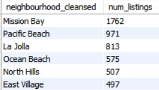

<!DOCTYPE html>
<html>
<h1>Airbnb Listings Analysis in San Diego</h1>
<h2>Introduction</h2>

Understanding market trends is essential for Airbnb hosts and property managers to optimize their strategies and boost profitability. Analyzing which listings are most popular can reveal features that attract the most guests, offering valuable insights for enhancing other properties.

This analysis aims to provide insights to the following questions of interest:

<b>
      1. Which neighborhoods have the highest number of listings? 
   2. What are the most expensive neighbourhoods to book?
   3. Who are the hosts with the most listings?
   4. Which months are the most popular to book?
</b>

The detailed lisitings data can be found <a href="https://insideairbnb.com/get-the-data/">here.</a>

<h2>Insights</h2>

From the analyis carried out, I was able to gain the following insights:

            1. The neighborhoods with the highest number of bookings are <b>Mission Bay, Pacific Beach, La Jolla, Ocean Beach, and North Hills.</b>
        2. The most expensive neighbourhoods to book are <b>Torrey Pines, Moreno Mission, La Jolla, Wooded Area, and Del Cerro.</b>
        3. The hosts with the most listings are <b>Surf Style, Bluewater Vacation Homes, Coast Vacation Homes, Evan, and La Jolla.</b>
        4. <b>March</b> is the most popular month to book Airbnbs in San Diego. This could be attributed to students going on Spring Break.

<h3>Analysis</h3>

Queries used to obtain these insights and the results will be shown below each of the business question.

<b>Which neighborhoods have the highest number of listings?</b>

<!-- which neighborhoods have the highest listings-->
      SELECT neighbourhood_cleansed, count(*) AS num_listings
      FROM listings
      GROUP BY neighbourhood_cleansed
      ORDER BY num_listings DESC;

</html>
